<!-- * Porque hago la comparacion -->
<!-- * Que metodos comparo -->
<!-- * Como los voy a comparar -->
<!-- * Donde se pueden encontrar mas detalles -->

<!-- * Comparacion -->
<!--   + Densidades seleccionadas -->
<!--   + Escenarios de comparacion -->
<!--   + Metricas utilizadas -->
<!-- * Analisis de resultados -->
<!--   + Analisis en termino de tiempo -->
<!--   + Analisis en termno de error -->
<!--   + Ejemplos -->
<!-- * Recomendaciones -->

```{r setup, echo = FALSE}
knitr::opts_chunk$set(echo = FALSE, out.width = "100%", fig.align = "center")
source("utils.R")

# Define colors
LIGHT_BLUE <- "#56B4E9"
LIGHT_GRAY <- "#474747"
DARK_RED <- "#c0392b"
```

# Why this study and this report

When doing data analysis, we are estimating probability density functions very 
frequently. Every time we take sample data from a continuous variable 
and generate a density plot to quickly visualize the underlying 
distribution, we are using a density estimator. Every time we explore our 
posteriors in a Bayesian modelling context, we are using a density estimator. 
Even those who dare to replace the harmless and truthful boxplots with violin plots, 
are using a density estimator.

It is likely we have never wondered about the method used to generate our density plot. 
It may even be the case that we have never realized that what 
generated the probability distribution in front of our eyes is 
actually an estimator, and not some kind of magic algorithm.
And as always we try to estimate something in statistics, 
there are many ways to do it. 

The most popular and most widely used estimation method is the combination
of the Gaussian Kernel Denstiy Estimator with its bandwidth parameter
estimated via a rule of thumb that minimizes the asymptotic 
estimation error assuming the sample came from a Gaussian distribution 
(we refer to this combination as the **standard method**).
It usually performs very well when the target distribution
presents a single mode and do not suffer from high skewness.
Also, it can be implemented with relative ease and 
computed very efficiently.

Even though that when working with real data we never really know 
whether our estimate is close to the true probability density function or not,
the performance of the standard method in a variety of scenarios is known. 
First, we can mention some characteristics due to using a bandwidth 
that assumes the objective function is Gaussian:

* The closer the true probability density function is to a Gaussian, 
the better the estimate.

* It tends to oversmooth (and sometimes very seriously) when
the target distribution presents multiple modes that are well separated. 
Its performance is even poorer if the spread around the modes is different.

In short, when the wiggliness of the targetd istribution differs 
largely from the one of a Gaussian, we can expect our estimation to be poor.

We can also mention some limitations due to using a Gaussian KDE:

* Theoretically, the method assumes the support of the density function
estimated is the real line. In practice, the reported estimation usually 
extends the range of the observed data by some multiple of its standard deviation.
This should not be the case when the domain of the function is bounded.
It does not make sense to report positive density in regions where it is 
known to be zero beforehand (i.e. when our variable represents a distance). 
There are some suggestions on how to fix this boundary issue,
but they are not always supported in computer implementations.

* The classic Gaussian KDE has a single bandwidth parameter, and consequently
it applies the same smoothness in all regions of the density. 
We are going to see that this characteristic is what makes it a 
poor estimator when there are multiple modes with different spread
and/or pronounced peaks, independently of how the bandwidth is estimated.

And a limitation that arises from the combination of both:

* The standard method was just not born to estimate highly skewed distributions. 
We have a poor bandwith determination due to the skewness 
and a problem in the boundaries because of the nature of the Gaussian KDE.

Concretely, our work is motivated by the well known drawbacks of the 
standard method used to estimate probability density functions. 
Our ultimate goal is to implement an alternative that performs 
better in those cases where the standard method does not work well but
remains reliable when it does a good job.

In this report we start by giving a summary of the simulation study 
carried out. We mention the methods compared, the conditions evaluated, 
and the metrics computed. Then, we proceed to interpret the results and 
conclude with some general advice based on our analysis.

# The study 

In our study we compare different methods to estimate 
one dimiensional probability density functions. The term *method* emphasizes that 
we not only choose a density estimator, but also an estimator for its parameters. 

An outline of the simulation is as follows:

1. Generate random values from a given probability distribution and a given sample size.
1. Estimate the density function with each one of the methods under study.
1. Compute the estimation error and the computation time.

We use the same sample sizes and number of repetitions for all the methods
except when the bandwidth parameter is estimated via the Sheather-Jones method.
In the first case we do 500 repetitions with sample sizes of 200, 500, 
1000, 5000, and 10000. In the latter, we do 200 repetitions with sample sizes of
200, 500 and 1000.

## Methods compared

Here we mention and briefly describe each of the methods under study.
A detailed explanation together with Python implementations can be found [here](https://github.com/tomicapretto/density_estimation).

### Density estimators

Before introducing the estimators we have to give some context.
Let $\{X_1, \cdots, X_N \}$ be an independent random sample from 
an unknown continuous probability density function $f$ in a 
certain space $\mathcal{X} \subset \mathbb{R}$. 
A kernel density estimator for $f$ is defined as

$$
\begin{array}{cc}
  \displaystyle \hat{f}(x; h) = 
  \frac{1}{Nh}\sum_{i=1}^N{\kappa\left(\frac{x - X_i}{h}\right)},
  & x \in \mathbb{R}
\end{array}
$$

where the **kernel function** $\kappa$ is (usually) a symmetric density function 
in $\mathbb{R}$ and $h$ is a positive smoothing parameter called **bandwidth**. 
Larger values of $h$ produce smoother estimations, 
while lower values produce more sinuous ones.

#### Gaussian Kernel Density Estimator

The **Gaussian kernel density estimator** arises when $\kappa$ is the 
probability density function of a standard Gaussian distribution. 
Thus, the estimator is of the form

$$
 \begin{array}{cc}
  \displaystyle \hat{f}(x; h) = 
  \frac{1}{Nh}\sum_{i=1}^N{\varphi\left( \frac{x - X_i}{h}\right)}, 
  & x \in \mathbb{R}
 \end{array}
$$

where

$$
\displaystyle \varphi(x) = \frac{1}{\sqrt{2\pi}}e^{-\frac{x^2}{2}}
$$

Putting all the pieces together, the estimator results in

$$
\hat{f}(x;h) = \frac{1}{Nh}\sum_{i=1}^N{\frac{1}{\sqrt{2\pi}}e^{-\frac{1}{2}\left(\frac{x - X_i}{h}\right)^2}}
$$

which can be seen as the simple average of $N$ Gaussian distributions centered at each 
$X_i$ with common standard deviation $h$.

#### Adaptive Gaussian Kernel Density Estimator

We use a type of adaptive Gaussian KDE also known as **sample point estimator**.
While the classic kernel density estimator uses a constant bandwidth $h$ 
for every kernel, the sample point estimator uses a variable bandwidth that
depends on $X_i$. The estimate of $f$ at every $x$ is then a 
simple average of differently scaled kernels centered at each data point $X_i$. 

The estimator is defined as follows:

$$
\hat{f}_{SP}(x; h(X_i)) = \frac{1}{N} \sum_{i=1}^{N}{ \frac{1}{h(X_i)} \kappa \left(\frac{x - X_i}{h(X_i)}\right)}
$$

Its name is due to the fact that the bandwidth $h(X_i)$ 
depends on the sample point $X_i$. For more deatails on how $h(X_i)$ is calculated 
see [this notebook](https://github.com/tomicapretto/density_estimation/blob/master/notebooks/04_adaptive_bandwidth_kde.ipynb).

#### Gaussian mixture fitted via EM algorithm

Both the classic Gaussian KDE and its adaptive version known as sample point estimator
or sample point Gaussian KDE can be seen as a mixture model. In both cases you are 
generating a probability density function by averaging Gaussian densities. 
Then, we can write both models in a more general manner as

$$
 \begin{array}{cc}
  \displaystyle \hat{f}(x) = 
  \sum_{i=1}^{N_c}{w_i \cdot \varphi\left(\frac{x -\mu_i}{\sigma_i}\right)}, 
  & x \in \mathbb{R}
 \end{array}
$$

where each component is a Gaussian density with mean $\mu_i$,
standard deviation $\sigma_i$ and a weight $w_i$. 
The estimators we have already introduced are particular cases
with the following characteristics:

* Classic Gaussian KDE
  + $N_c = N$: The number of observations^[Fastest implementations use binning 
    so $N$ is the number of bins instead of the number of observations.].
  + $\mu_i = X_i$: Each one corresponds to one of the data points.
  + $\sigma_i = h$: A unique bandwidth for all the components.
  + $w_i$: All the components in the mixture have the same weight $\frac{1}{N}$.

* Sample Point Gaussian KDE
  + $N_c = N$: The number of observations.
  + $\mu_i = X_i$: Each one corresponds to one of the data points..
  + $\sigma_i = h(X_i)$: There is a different bandwidth for each component in the mixture.
  + $w_i$: All the components in the mixture have the same weight $\frac{1}{N}$.
  
The EM algorithm enables us to fit all the components of the
Gaussian mixture model entirely from the data via maximum likelihood. 
An explanation of this algorithm in this context can be found
[here](https://github.com/tomicapretto/density_estimation/blob/master/notebooks/04_adaptive_bandwidth_kde.ipynb).
  
* Gaussian mixture fitted via the EM algorithm
  + $N_c = N^*$: Not equal to the number of observations but it depends on it.
    In our implementation it ranges from 10 to 30.
  + $\mu_i$: Estimated by the EM algorithm.
  + $\sigma_i$: Estimated by the EM algorithm.
  + $w_i$: Estimated by the EM algorithm.
  
In summary, as we move forward the mixture model becomes more flexible.
We start with a simple average of equally scaled Gaussian distributions. 
Next let the bandwidth vary for each kernel, resulting in a 
simple average of differently scaled Gaussian distributions.
And finally, we allow each component to have a different weight and we 
have a weighted average of differently scaled Gaussian distributions where
their location parameter is also estimated from data.

Finally, we shall note note that as the models become more flexible, 
they also become more computationally demanding. 
This aspect is important for an interactive exploratory data analysis or 
modelling where you may need to generate hundreds of density 
estimates to visualize resampled data.

#### Example 

We generated 8 random values from a Gaussian mixture and generated a
density estimation with each of the three methods introduced. 
In the first panel we see the classic Gaussian KDE, which poses 
a Gaussian density on top of each value with a common standard deviation and
scales them by $1 / n$, where $n$ is the number of data points.
The second panel shows the adaptive version, which poses Gaussian densities
with different standard deviations, but still weights equally.
We can see the standard deviation decreases where the data is more concentrated
and increases in more sparse regions. 
Finally, the third panel shows a Gaussian mixture fitted by the EM algorithm.  
Note the number of components does not necessarily match the number of points observed.
Since all the parameters (means, standard deviations and weights) are fitted by 
the EM algorithm, the Gaussian kernels are not necessarily placed on top 
of any of the points and the areas below the gray curves are different.


```{r kde_comparison, cache = TRUE, dev = "tikz", fig.process = pdf2png, fig.width=7, fig.height=3}
set.seed(32111)

rvs <- c(rnorm(5), rnorm(3, 0.9, 0.6))
x_grid <- seq(-3, 4.2, length.out = 500)
h <- 0.45

# Gaussian KDE  
out <- sapply(rvs, FUN = function(x) dnorm(x_grid, x, h))
y <- apply(out, 1, mean)

# Plot 1
par(mfrow = c(1, 3))
par(mar = c(1.5, 0.8, 2, 0.8), mgp = c(1.5, 0.5, 0))
plot(1, type = "n", bty = "n", axes = FALSE, cex.main = 1.4,
     xlim = c(-3, 3.3), ylim = c(0, 0.44), 
     main = "Gaussian KDE") 

abline(h = 0, lwd = 2)

for (j in seq_along(rvs)) {
  lines(x_grid, out[, j] / 8, lty = "dashed", lwd = 2, col = LIGHT_GRAY)
}

points(rvs, y = rep(0, length(rvs)), cex = 2, lwd = 2, pch = 21, bg = DARK_RED)
lines(x_grid, y, col = LIGHT_BLUE, lwd = 4)

# Adaptive KDE
pdf_interp <- approx(x_grid, y, rvs)$y
geom_mean <- exp(mean(log(pdf_interp)))
adj_factor <- (geom_mean / pdf_interp) ** 0.5

bw_adj = h * adj_factor

out <- mapply(FUN = function(x, h) dnorm(x_grid, x, h), rvs, bw_adj)
y <- apply(out, 1, mean)

# Plot 2
plot(1, type = "n", bty = "n", axes = FALSE, cex.main = 1.4,
     xlim = c(-3, 3.3), ylim = c(0, 0.44),
     main = "Adaptive Gaussian KDE")
abline(h = 0, lwd = 2)
for (j in seq_along(rvs)) {
  lines(x_grid, out[, j] / 8, lty = "dashed", lwd = 2, col = LIGHT_GRAY)
}
points(rvs, y = rep(0, length(rvs)), cex = 2, lwd = 2, pch = 21, bg = DARK_RED)
lines(x_grid, y, col = LIGHT_BLUE, lwd = 4)

# EM KDE
mu <- c(-1.4, 0, 2)
sigma <- c(0.5, 0.38, 0.8)
wt <- c(0.35, 0.4, 0.15)

out <- mapply(FUN = function(mu, s) dnorm(x_grid, mu, s), mu, sigma)
y <- out %*% wt

# Plot 3
plot(1, type = "n", bty = "n", axes = FALSE, cex.main = 1.4,
     xlim = c(-3, 3.3), ylim = c(0, 0.44),
     main = "Gaussian mixture via EM")
abline(h = 0, lwd = 2)
for (j in seq_along(mu)) {
  lines(x_grid, out[, j] * wt[j], lty = "dashed", lwd = 2, col = LIGHT_GRAY)
}
points(rvs, y = rep(0, length(rvs)), cex = 2, lwd = 2, pch = 21, bg = DARK_RED)
lines(x_grid, y, col = LIGHT_BLUE, lwd = 4)
```

### Bandwidth estimators

A very popular measure of discrepancy between a density function and an estimate
is the Integrated Squared Error

$$
\text{ISE}(\hat{f}(x)) = \int{[\hat{f}(x) - f(x)]^2}dx
$$

An easy way of thinking about it is as follows. We have two functions, one is
the true density $f(x)$ and the other is our estimate of it $\hat{f}(x)$. 
Then we subtract one from the other and square the result. 
That gives us a function, which is always positive.
Finally, we compute the area below that function. That is our measure of error.

But the ISE only measures the performance of a single estimation. 
In order to measure the performance of an estimator, we need to compute the 
expected value of the ISE for a given estimator. 
It is known as the Mean Integrated Squared Error

$$
\text{MISE}(\hat{f}(x)) = \mathbb{E}_f\int{[\hat{f}(x) - f(x)]^2}dx
$$

In the context of the classic Gaussian KDE, an asymptotic first-order approximation 
for the MISE is given by

$$
\frac{1}{4} h^4 R(f'') + \frac{1}{2N\sqrt{\pi}h}
$$

where 

$R(f'')  = \int{[f''(x)]^2 dx}$, which can be thought as a measure of the 
wiggliness of the function $f$.

It is possible to show the value of $h$ that minimizes the MISE asymptotically 
(a.k.a. AMISE) is

$$
h_{\text{AMISE}} = \left(\frac{1}{2N\sqrt{\pi} R(f'')} \right)^{1 / 5}
$$

The computation of the optimal $h_{\text{AMISE}}$ in a Gaussian KDE requires 
knowing $R(f'')$, which depends on the unknown function we want to estimate.

#### Rules of thumb

##### Scott's rule

Scott introduces what he names the **normal reference rule**. 
This is derved when you assume that the $f$ in $h_{\text{AMISE}}$ formula is 
a Gaussian density function. Then, $R(f'') = 3/(8 \sqrt{\pi}\hat{\sigma}^{5})$ 
and 

$$
h_{\text{Scott}} = \left(\frac{4\hat{\sigma}^5}{3N} \right)^{1/5} 
\approx 1.058\hat{\sigma}N^{-0.2}
$$

where $\hat{\sigma}$ is the sample standard deviation.

##### Silverman's rule

Silverman proposed a modification to the Scott's rule in order to make it 
more robust to differences between the true $f$ and a Gaussian density. 

$$
h_{\text{Silverman}} = 0.9AN^{-0.2}
$$

where $A = \min\{\hat{\sigma}, \frac{R}{1.34}\}$ and $R$ is the interquartile range.

#### Plug-in methods

The plug-in approach consists of replacing the unknown quantity $R(f'')$ in the
$h_{\text{AMISE}}$ expression with an estimate.
The difference between this method and the rule of thumb is that the rule of 
thumb imposes a distribution from a parametric family, 
while this approach estimates $R(f'')$ from the data using a non-parametric approach.
Estimating $R(f'')$ by $R(\hat{f}_g'')$ requires to choose a bandwidth $g$ for the
so called pilot estimate, which can be done in many ways.

The two methods included here are only briefly introduced because of their
mathematical complexity. For a better description of both you can consult 
[this notebook](http://localhost:8888/notebooks/Desktop/estimacion_densidad/notebooks/03_more_bandwidth_selectors.ipynb) 
and the original papers referenced in there. 

##### Sheather-Jones method
<!-- No estoy muy seguro sobre eso que puse, ni de que tan claro esta. -->
While this method does not assume that $f$ is a Gaussian density in order
to incorporate that into a rule of thumb, it does assume it when 
it calculates the bandwidth of estimations of derivatives of $f$ that
are required to get the final bandwidth.

Even though we do not give further details of the method here, 
we do note the method is considerably slower than normal reference rules
because it involves computing all pairwise differences between
the data points and a root finding problem solved by a numerical method.

##### Improved Sheather-Jones method

The Improved Sheather-Jones method is presented in Botev et. al. (2011). 
The author claims it is "*genuinely non-parametric and completely data-driven*". 
Unlike Sheather and Jones, they do not make any normality assumptions 
in any of the estimation stages.

An important characteristic of this algorithm, as stated by the authors,
is that it is not significantly slower than a normal reference rule. 
Similar to the Sheather-Jones method, this one implies a root finding problem.
However, it is much faster because the computation and memory demand are much lighter.

#### Hybrid

After performing many small simulations and tests with the different 
bandwidth estimation methods under different circumstances, we thought
we could try to modify the existing alternatives or constructing new ones
and evaluate if we found any improvement.
Since the construction is derived from our empirical work and not
a well defined theoretical basis, we decided to call it the **experimental method**.

##### Experimental method

We noticed the Improved Sheather-Jones did a good work at capturing the 
general shape of the density function $f$ when it contains multiple modes with 
different spreads. However, it does it at the cost of excessive noise (under smoothing).
In addition, it is theoretically known that normal reference rules 
(either Scott's or Silverman's) tend to oversmooth in these cases.

Consequently, this experimental method consists of just estimating the bandwidth
via both the Silverman's rule and the Improved Sheather-Jones method and 
average them^[In this case both bandwidth estimations receive the same weight. 
In the future we could try with a weighted average].

### Selected target probability density functions

The selected probability density funcitons are the result of a compromise between
our desire to simulate from different probability density functions 
while keeping the final number as low as possible. 

We think that the 11 probability density functions selected cover a wide range
of cases that can occur in practice. 

**Unimodal distributions:**

1. $N(0, 1)$
2. $N(0, 2)$
3. $\frac{2}{3}N(0, 1) + \frac{1}{3}N(0, \frac{1}{10})$

**1.** and **2.** are taken as a baseline. 
Any acceptable method should have a good performance when estimating Gaussians.
We included different spreads to evaluate if it impacts the result. 
**3.** is a distribution where the density around is mode is much more 
concentrated than in the rest of the support.

**Bimodal distributions:**

4. $\frac{1}{2}N(-12, \frac{1}{2}) + \frac{1}{2}N(12, \frac{1}{2})$
5. $\frac{1}{2}N(0, \frac{1}{10}) + \frac{1}{2}N(5, 1)$
6. $\frac{3}{4}N(0, 1) + \frac{1}{4}N(1.5, \frac{1}{3})$
7. $\frac{3}{5}N(3.5, \frac{1}{2}) + \frac{2}{5}N(9, 1.5)$

**4.** is a multimodal distribution with two modes that have the same spread and are 
very well separated. The rest are differente cases of two modes with different
spread and seperation.

**Skewed distributions:**

8. $\Gamma(k = 1, \theta = 1)$
9. $\Gamma(k = 2, \theta = 1)$
10. $\text{Log} N(0, 1)$
11. $\beta(a = 2.5, b = 1.5)$
12. $\frac{7}{10}\Gamma(k = 1.5, \theta = 1) + \frac{2}{10}N(5, 1) + \frac{1}{10}N(8, \frac{3}{4})$

**8.**, **9.** and **10.** are cases of right-skewed distributions with different 
degrees of skewness. **9.** and **10.** may appear similar, but the lognormal 
density concentrates more density around its mode and the curve
decreases abruptly on the left side, which ruins many estimation methods [FIX].
We also have the Beta distribution **11.** which is left-skewed and bounded
on both sides. Finally, the last distribution is a $\Gamma(k = 1.5, \theta = 1)$
with two bumps in its tail.

```{r target_densities, cache = TRUE, dev = "tikz", fig.process = pdf2png}
par(mfrow = c(4, 3), mar = c(2.3, 3, 1.4, .2), mgp=c(1.3, 0.5, 0))
for (nm in names(dists)) get_plot(nm)
```

## Metrics evaluated

In this simulation we compute two metrics. One measures the error and the other
measures time.

### Error

We measure the difference between the estimation $\hat{f}$ and the 
true function $f$ with the Integrated Squared Error:

$$
\text{ISE}(\hat{f}(x)) = \int{[\hat{f}(x) - f(x)]^2}dx
$$

Since we compute the ISE in every iteration we do for a given method, 
we end up with an ISE empirical distribution^[The integral is computed via 
the trapezoidal rule using the same grid that is obtained with the density estimate.]. 
Thus, we are not only able to estimate the MISE, but any other summary we want.

### Time

The time necessary to produce an estimation is originally measured in seconds. 
However, we may use a different scale depending on the method when plotting. 
(i.e. when all measurements are in the order of microseconds). 

# Results

Our desire to cover as many cases as possible led us to simulate so 
many scenarios that it now becomes impractical to analyze them one by one.
So we decided to take an unusual alternative. 
On the one hand, we select a subset of the simulated densities and interpret 
the results we obtained for them. Fortunately, what we conclude here
is also applicable for the other densities.
We will make a comment if any particularity is seen in other cases.
On the other hand, we created an interactive application so 
anyone interested in doing a deeper analysis or checking our 
statements can do it in an easy manner without having to write code.

We selected 4 densities based on their different characteristics. 
They are listed below together with a short description.

* $N(0, 1)$: It is a baseline density. 

* $\frac{1}{2}N(0, \frac{1}{10}) + \frac{1}{2}N(5, 1)$: It is a bimodal distribution
where the modes moderately separated and present different variability.

* $\text{Log} N(0, 1)$: An asymmetric distribution which is sort of a middle point
between the two other gamma densities used in the simulation.

* $\beta(2.5, 1.5)$: A distribution bounded on both sides with a moderate skewness.

In this report we interpret boxplots where we visualize the empirical distribution
of the metrics we computed. We also include some of the heatmaps that
can be generated in our interactive application.

The steps to access the application can be consulted
[here](https://github.com/tomicapretto/density_estimation). The
app lets you generate boxplots to visualize the distribution
of the metrics for different densities, methods and sample sizes. 
You can also see heatmaps that present the information in a summarized manner.
In addition, there is a panel where you can generate random samples, 
estimate the underlying density function with any of the presented methods
and compare the result with the true function. 
More information and examples are within the application.

## Time

### Boxplots {.tabset}

#### Gaussian KDE {.tabset}

The classic Gaussian KDE is expected to be the fastest of the three alternatives 
we implemented. Its speed is because the implementation is actually an 
approximation to the Gaussian KDE that bins the observed data and computes
the summatory as a convolution. 
[This notebook](https://github.com/tomicapretto/density_estimation/blob/master/notebooks/01_gaussian_kde.ipynb) explains why it is faster and also shows an implementation.

##### Scott's rule

```{r}
knitr::include_graphics("imgs/boxplots/time/Gaussian_KDE_&_Scott's_rule.png")
```

The computation time is almost always below 400 μs for all the sample sizes and
all the densities under study. In all the cases the distribution is right-skewed
but a long tail is only seen when n=10000 in the second panel.

##### Silverman's rule

```{r}
knitr::include_graphics("imgs/boxplots/time/Gaussian_KDE_&_Silverman's_rule.png")
```

When we use Silverman's rule we are doing exactly the same that with Scott's, 
but we are also computing the interquartile range of the data. This is what moves
our times from 200-400μs to 500-1000μs.   
In general, we can expect the computation time to be similar no matter the 
underlying distribution. However, the long tails in the first two panels 
warns us that the time can be larger in some cases. 

<!-- Agregar al final: La realida que esta demora extra, incluso en comparacion a Scott -->
<!-- no tiene ningun impacto si lo qeu nos interesa es generar hasta centenas  -->
<!-- de densidades. Recien notaríamos una diferencia cuando queremos generar miles -->
<!-- de densidades al mismo tiempo. -->

##### Sheather-Jones

```{r}
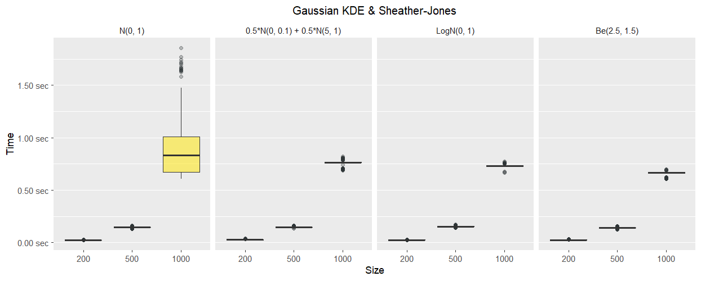
```

The first two things we note are that we jumped from μs to seconds and 
the substantial increase in the computation time as we increase the sample size. 
While the method can be used interactively to estimate a couple of densities 
based on a moderate number of observations, it becomes impractical if we want 
to use this bandwidth estimator hundreds or thousands of times. 
This is the reason why we decided not to run simulations with larger sizes.

As a final note, we highlight the larger variability seen in the first panel. 
It is a consequence of the root finding algorithm requiring different times to
converge.

##### Improved Sheather-Jones
```{r}
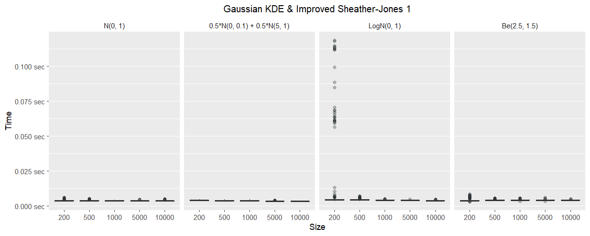
```

In this first plot we see that the distribution for the log normal density when 
n = 200 presents between 10 and 20 outliers. This is a consequence of the root
finding algorithm taking more time to converge when the number of data points
is low. The rest of the times are far below 0.0125 seconds so we generated 
the same plot after a 10% trim to the right tail of each distribution to
focus on the core of the distribution.

**10% trim:**

```{r}
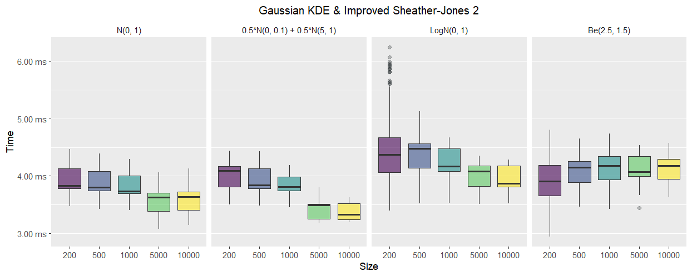
```

We note the mean computation time is around 4ms for all the cases. 
What's more, this mean value tends to be smaller for larger sample sizes. 
This is because the root finding algorithm requires less time when there 
is more data available.

<!-- Agregar despues, tal vez con los heatmaps:  -->
<!-- Si bien los tiempos son 10 veces mayores a los que necesita un Scott's o un Silverman, -->
<!-- solo vamos a notar la diferencia cuando tengamos que realizar mas de mil estimaciones. -->
<!-- Todos estos metodos son igualmente aptos para el uso interactivo cuando se  -->
<!-- necesitan estimar hasta unas 500 densidades. -->

##### Experimental
```{r}
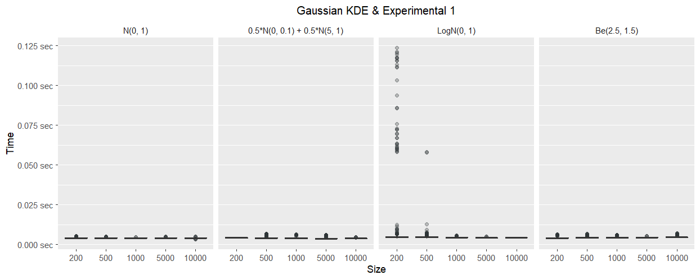
```

Since this method requires computing the bandwidth via Improved Sheather-Jones and
Silverman's rule, we know its computation time is going to be roughly the sum of
the times of the mentioned methods. 

Just as happened with the Improved Sheather-Jones, here we also have some 
outliers when the sample size is low. After trimming the right tail, we see
the mean time is around 4-5ms.

<!-- Nota agregar: El root finding algorithm se toma mas tiempo para encontrar una solucion  cuando n es chico solo en algunos casos (Log N).  -->

**10% trim:**

```{r}
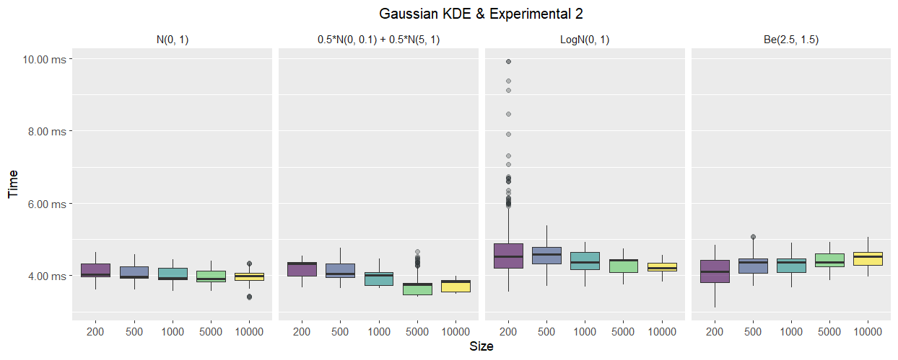
```

#### Adaptive Gaussian KDE {.tabset}

The adaptive Gaussian KDE is expected to be slower than the Gaussian KDE beforehand.
This method requires a pilot density estimate which is carried out by the 
Gaussian KDE, and after producing this estimate it is used to compute a modification
factor for the bandwidth to be used in a second estimation stage. 

Independently of which bandwidth we use, we can see the densities are divided 
in two groups in terms of time.
The first group is composed of the densities in the first two panels,
the Gaussian distribution and the Gaussian mixture. The second group 
is composed of the log normal and the beta distributions.
Due to the fact that we have a bandwidth for each data point, the convolution
cannot be used to compute the estimation. Consequently, when the distribution
has a bounded domain and we apply a boundary correction, the time demand increase is noticeable. Thus, the time increase in the second group is because the two 
distributions have a bounded domain and a boundary correction is applied.

##### Scotts's rule
```{r}
knitr::include_graphics("imgs/boxplots/time/Adaptive_Gaussian_KDE_&_Scott's_rule.png")
```

If we compare the computation times seen here with the ones shown for the Scott's
rule and Gaussian KDE, we can easily see there is a 10 times increase in computation time. As mentioned above, this time increase is more serious when we need to apply
a boundary correction. 

<!-- No olvidar agregar que estar en 5 ms no nos priva de usar el metodo.  -->
<!-- La diferencia la vamos a ver la hora de producir cientos o miles de densidades. -->

##### Silverman's rule
```{r}
knitr::include_graphics("imgs/boxplots/time/Adaptive_Gaussian_KDE_&_Silverman's_rule.png")
```

As happened with the Scott's rule, we also see a substantial increase in 
computation time. However, in contrast to what happens with the Gaussian KDE, 
computation times for Scott's and Silverman's rules are very similar
when using the adaptive Gaussian KDE.  
In this adaptive scenario, most of the extra time is due to how we compute the
kernel sum. Thus, the extra computation of the interquartile range for 
the Silverman's rule does not contribute much to the final result.

##### Sheather-Jones
```{r}
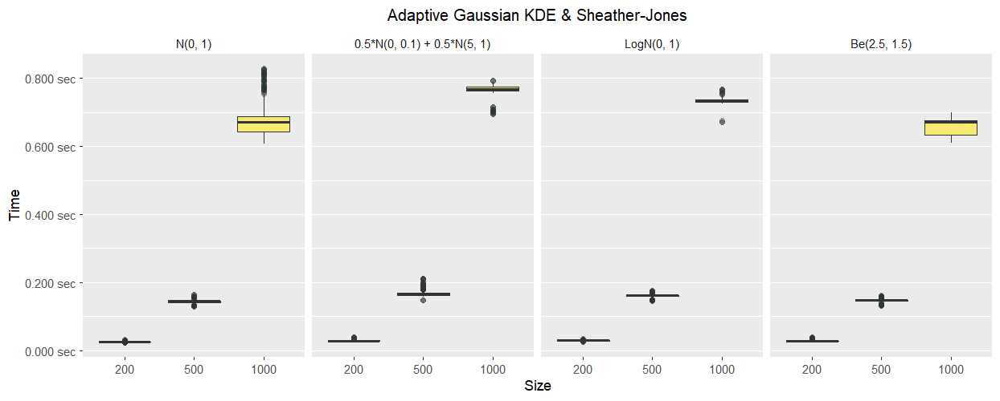
```

Computations time in the adaptive scenario are very similar to the ones in the
non-adaptive scenario. When we use the Sheather-Jones bandwidth estimator 
together with a KDE, the great majority of the time is consumed by the bandwidth 
calculation. Then, the computation of the density does not impact the result. 
The only difference between this plot and the one for the Gaussian KDE is that
here the variability for the Gaussian distribution is smaller.

##### Improved Sheather-Jones
```{r}
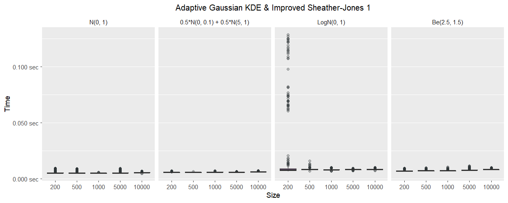
```

Again, we can see the outliers due to slow convergence when the sample size is small. 
In this simulation we had more problems with convergence that are reflected when
we apply an extra trim to the right tail of the distribution. From these two plots,
we can only see that the times are usually below 10ms.  

Heatmaps below are going to tell us the numbers with more accuracy.

**10% trim:**

```{r}
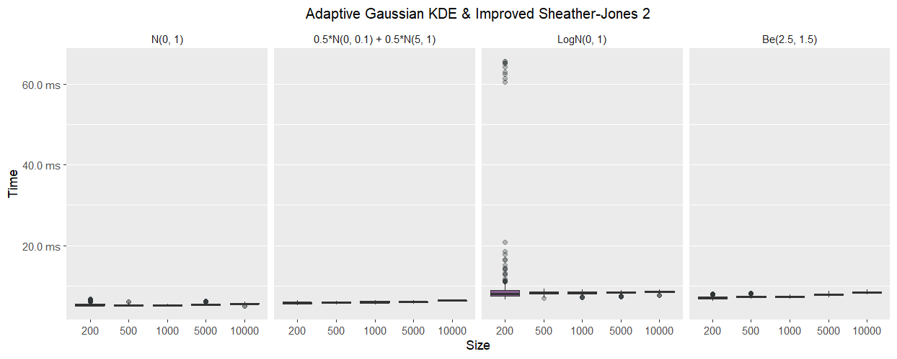
```

##### Experimental
```{r}
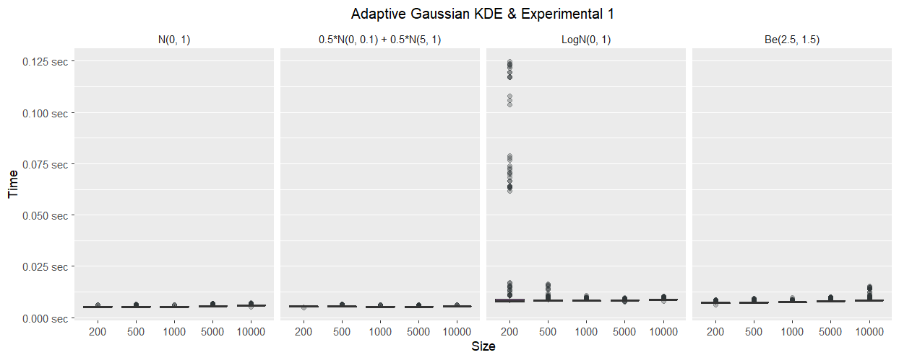
```

Same conclusions than in Improved Sheather-Jones. The difference between 
the bounded and unbounded distributions is very clear in the second plot.

**10% trim:**

```{r}
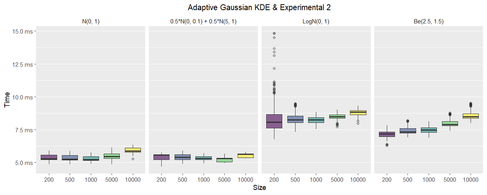
```

#### Adaptive Gaussian KDE via EM

```{r}
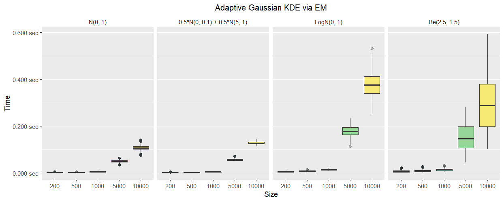
```

The first thing we note is there is a great variability in computation time
for different sample sizes. Both the mean time and the variability of the time increase. In addition, time also varies between densities. 
Those densities that are truly a Gaussian mixture are fitted faster, while
the rest are more time demanding. 

Since the first plot does not allow us to see clearly the computation times for
sample sizes 200, 500 and 1000, we generated the following plot.

```{r}
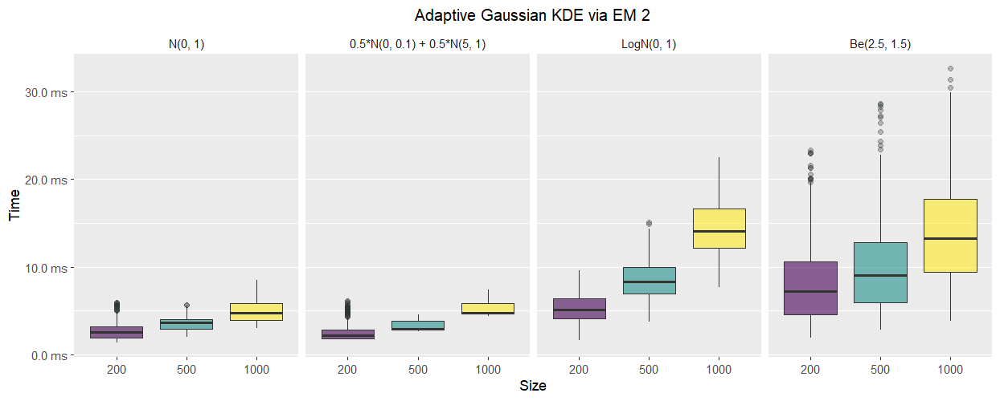
```

Here we clearly see the time is below 10ms for Gaussian mixtures and 
below 30ms for the other distributions. 

<!-- Entonces aclarar que este metodo podria ser usado para muchas replicas si nuestro  vector no es tan grande. En el caso que el vector sea grande, demoraremos mas. -->

### Heatmaps {.tabset}

Before we start talking about the results shown in the heatmaps we 
describe the summaries they present. Each box in the plot corresponds 
to a combination of a density estimator, a bandwidth method and a sample size. 
The first number in the first row correponds to the 2% right trimmed mean 
of the metric in study (time, in this case). 
The trimming is applied to decrease the effect of serious outliers. 
The number between parenthesis is the ratio between the best mean value and 
the mean for the cell, for a given sample size. 
The best result presents a ratio of 1, while all the rest have a value above 1. 
Finally, the numbers between brackets in the second row correpond to the central 94% interval for the empirical density.

Colors are used to quickly visualize which methods are close to the best (blue)
and which methods perform poorly (yellow).

#### $N(0, 1)$

```{r}
knitr::include_graphics("imgs/heatmaps/time_gaussian_1.png")
```

    
#### $\frac{1}{2} N(0, 0.1) + \frac{1}{2} N(5, 1)$

```{r}
knitr::include_graphics("imgs/heatmaps/time_gmixture_3.png")
```

#### $\text{Log}N(0, 1)$

```{r}
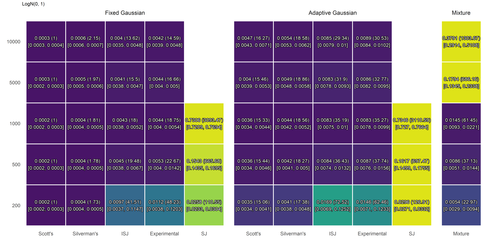
```

#### $\beta(2.5, 1.5)$

```{r}
knitr::include_graphics("imgs/heatmaps/time_beta_1.png")
```

<!-- Nota sobre los tiempos: Comentar que la implementacion usada puede ser mejorada -->
<!-- si se eliminan chequeos interno ya que la funcion no es especifica para -->
<!-- esta simualcion, sino que puede ser usada por cualquier usuario.  -->
<!-- Sin embargo, dado que estos chequeos se realizan en todos los casos,  -->
<!-- la comparacion entre los tiempos tiene sentido. -->

### {.unlisted .unnumbered}

No matter what is the target density and the sample size, the fastest method
is the combination of the Gaussian KDE with Scott's rule. This method usually
required between 200 and 300μs in our simulation. The second fastest method
is the Gaussian KDE with Silverman's rule. As mentioned earlier, the difference
between these two bandwidths estimators is the computation of 
the interquartile range of the data.

All the other methods are at least 5 times slower than the fastest. 
The slowest, by far, is any combination that involves the Sheather-Jones bandwidth. 

**Gaussian KDE**

* Both the Improved Sheather-Jones and the Experimental methods are usually between
10 and 20 times slower than the fastest method for all the sample sizes except 
for 200. In this case, a ratio between 40 and 50 is seen for the 
log-normal density. Generally, the ratio between the mean times decrease as 
the sample size increses.

* The Sheather-Jones method is between 110 and 4000 times slower than the fastest. 
These numbers also show the method scales very poorly. It becomes too slow with
a moderate increase in sample size.

**Adaptive Gaussian KDE**

* When the target density is unbounded (does not require boundary correction) both Scott's and Silverman's rule are approximately between 6 and 13 times 
slower than the fastest method. 
The ratio is between 15 and 18 when boundary correction is applied. 

* The Improved Sheather-Jones and Experimental bandwidths are between 17 a 25 times
slower than the optimal method if no boundary correction is applied. Otherwise, 
the ratio is usually between 28 and 38. As observed with the classic Gaussian KDE,
here we also have a larger ratio when the sample size is 200 and the target
density is the log-normal. It increases to 60-70.

* The Sheather-Jones method is between 110 and 3300 times slower than the fastest.

**Gaussian Mixture via EM**

When the sample size is 1000 or smaller, this method is approximately between 10 
and 60 times slower than the fastest. However, this ratio varies depending on
the target distribution. When the target distribution is a Gaussian mixture
the convergence is faster and the ratio is between 10 and 20. 
In the other two cases it is between 20 and 60.

When the sample size is 5000 or larger, the method becomes much slower. 
It is between 200 and 400 slower than the fastest method when the target density is 
a Gaussian mixture, and between 500 and 1300 in other cases. Thus, we can see
the method is significantly more time consuming than faster alternatives,
but its convergence speed is also very variable.

<!-- Para las conclusiones generales: -->
<!-- Its computational demand is similar than the Adaptive Gaussian KDE with  -->
<!-- any Improved Sheather-Jones based bandwidth. -->

## Error 

### Boxplots {.tabset}

In all the cases the third column with the Gaussian mixture via EM is kept
to ease the comparison. However, we must recall it is not using any of the bandwidth
methods listed in the tabs since all the parameters are fitted via 
Expectation-Maximization.

#### Scotts's rule
```{r}
knitr::include_graphics("imgs/boxplots/error/Scott's_rule.png")
```

#### Silverman's rule
```{r}
knitr::include_graphics("imgs/boxplots/error/Silverman's_rule.png")
```

#### Sheather-Jones
```{r}
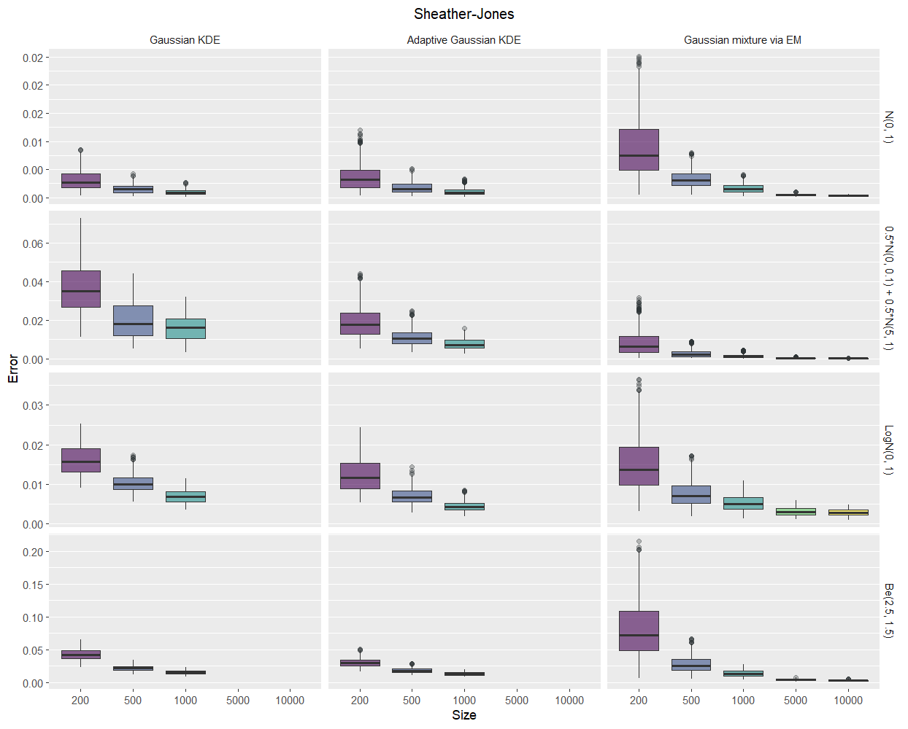
```

#### Improved Sheather-Jones
```{r}
knitr::include_graphics("imgs/boxplots/error/Improved_Sheather-Jones.png")
```

#### Experimental
```{r}
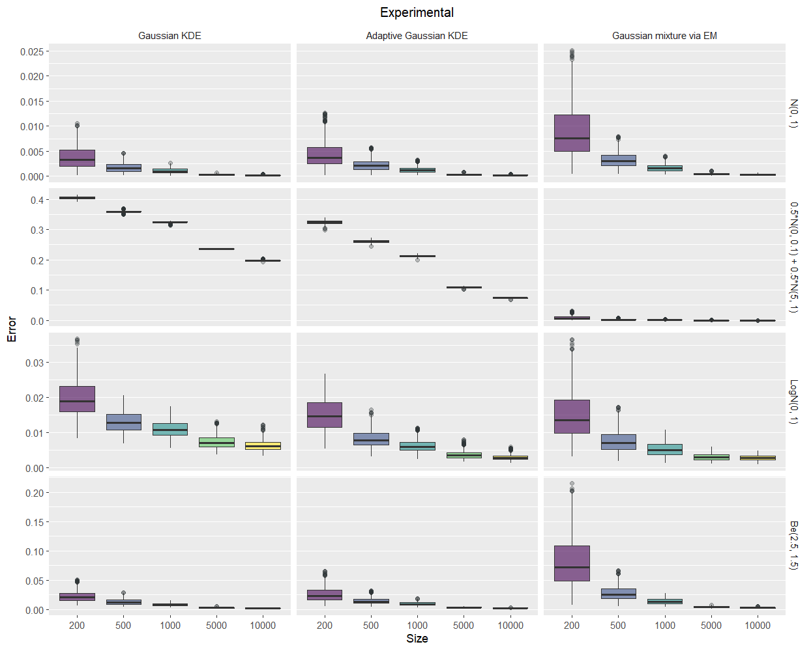
```

### {.unlisted .unnumbered}

As a general comment, we note that in all the cases (except in one that is 
explained later) the error decreases as we increase the sample size. However,
this does not mean that if we keep increasing the size we are going to lower the
error until it is 0 in all the cases.

**$N(0, 1)$**

* If we compare the vertical axes between the different rows we see the Gaussian distribution is the one that is usually estimated with the smallest error.

* The Gaussian mixture fitted via EM performs worse than all the other combinations
of density estimator and bandwidth.

* All the other bandwidth methods seem to have similar distributions for the error. Their differences will be clearer with the heatmaps.

**$\frac{1}{2} N(0, 0.1) + \frac{1}{2} N(5, 1)$**

* The error is very different for different methods.

* Both Scott's and Silverman's rule perform very poorly, no matter we use 
the Gaussian KDE or its adaptive version.

* The Gaussian mixture via the EM has the smallest error for all the 
sample sizes.

* The Sheather-Jones and Improved Sheather-Jones methods have similar performances. 
They are close to the best, but they do not outperform it. When we use the adaptive
Gaussian KDE and the ISJ bandwidth, we see the error decreases until it increases again
(specially when n = 10000). 
We will try to explain this phenomena with an example later.

* The Experimental bandwidth method improves Silverman's rule performance,
but it is not as good as what we got with Sheather-Jones / Improved Sheather-Jones
methods. Also, we see it performs better with the adaptive Gaussian KDE 
than the classic version.

**$\text{Log}N(0, 1)$**

* No matter which bandwidth method we use, the adaptive KDE shows a smaller error
than the fixed version.

* No method clearly outperforms the others. 
However, we can see that using the Scott's rule results in a poor result 
compared to the other alternatives.

**$\beta(2.5, 1.5)$**

* As with the log-normal distribution we can't see a clear winner from the boxplots,
but we can see a clear loser. In this case, the Gaussian mixture via EM performs has 
a considerable larger error than the rest, at least for moderate to small sample sizes.


### Heatmaps {.tabset}

#### $N(0, 1)$

```{r}
knitr::include_graphics("imgs/heatmaps/error_gaussian_1.png")
```

As noted earlier, regardless of the sample size, the Gaussian mixture via EM has
a bigger error than any of the other alternatives.
However, in this case, the relative differences are moderate (i.e. no method doubles the error of another). Overall, the best results are seen when we use the classic
Gaussian KDE. In addition, with the empirical intervals we can see their
spread are similar too.

If we focus on smaller sample sizes, we are going to find differences between
the methods in study. When the method is more flexible, it tends to have a 
larger error. For example, the Experimental bandwidth has an error 20% higher 
than the optimal when used with a Gaussian KDE and it goes up to 
40% when used with its adaptive version.

On the other hand, when the sample size gets larger, all the methods 
tend to have similar performances. Even though we can see a ratio of 1.29 and other
of 1.15 when n = 10000, there is no practical difference between any of the
bandwidths with such a large sample. 

#### $\frac{1}{2} N(0, 0.1) + \frac{1}{2} N(5, 1)$

```{r}
knitr::include_graphics("imgs/heatmaps/error_gmixture_3.png")
```

In this case there is a big difference between the error along the methods
under study. It can be easily noted by seeing the color varies very little
within a column, but it varies a lot between columns. 
For all the sample sizes, the Gaussian mixture via EM has the lowest mean error, 
by far. 

The Sheather-Jones and the Improved Sheather-Jones bandwidths share the second
place. They perform a little better when used with the adaptive Gaussian KDE. 
All the other methods have an error between 50 and 2500 times higher than
the best. 

The most interesting thing of this case is that the errors are so different
that you ask yourself if an error ratio of 500 means the method reflected
in the numerator is 500 times worse than the method in the denominator. This
motivates an example we are going to mention right after this section.

Another interesting issue to remark is that when using the Adaptive Gaussian KDE
and the Improved Sheather-Jones bandwidth, the error does not decrease
monotonically as the sample size increases. 
Again, this is explained with an example in the next section.

#### $\text{Log}N(0, 1)$

```{r}
knitr::include_graphics("imgs/heatmaps/error_logn_1.png")
```

No matter the bandwidth method used, the adaptive KDE works better than the
fixed bandwidth alternative. 

In this scenario we see that, with the exception of the Scott's rule, 
all the bandwidth estimators together with the Adaptive Gaussian KDE
and the Gaussian mixture via EM are the methods with the best results for
all the sample sizes. 

In a case like this, where many methods have a similar mean error,
we can compare their variability. For example, let's consider n = 10000. 
The Silverman's rule shows the shortest interval, 
[0.0022, 0.0034], while the Improved Sheather-Jones method shows the widest, 
[0.0013, 0.0084]. When choosing a density estimation method, one should also
consider how variable it is.

#### $\beta(2.5, 1.5)$

```{r}
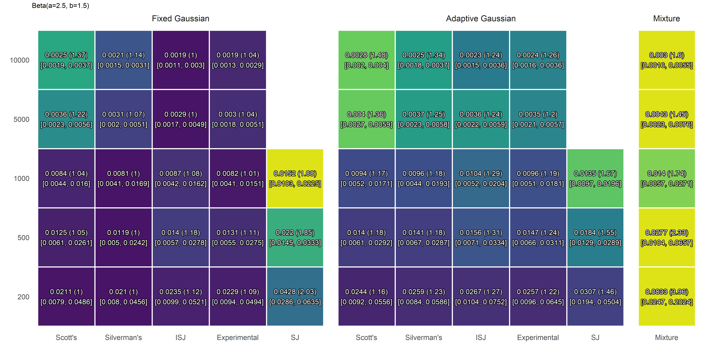
```

With the exception of the Gaussian mixture via EM and methods that use
the Sheather-Jones bandwidth, there are no large differences between
the other methods. No method is superior for all the sample sizes.

We can note the fixed bandwidth Gaussian KDE has a slightly smaller
mean error than the adaptive variant. 

If, conditional on density estimator, we look at small to moderate sizes 
(200, 500 and 1000) we see that all the bandwidth methods perform similarly.
However, Scott's rule is a little worse than the rest when the 
sample size is large (5000, 10000).

Finally, given a sample size, spread measured by the length of 
the 94% central density interval is similar for all bandwidths.

<!-- En los ejemplos poner la estimacion de la gaussian mixture 3 mediante  -->
<!-- EM (que da el mejor resultado en terminos de error) y poner mediante  -->
<!-- ISJ y experimental. Lo que quiero mostrar aca es que por mas que el error  -->
<!-- sea entre 250 y 500 veces mas grande, el resultado sigue siendo bueno a simple vista. -->

<!-- El peligro de usar una alternativa como el ISJ es que puede dar una  -->
<!-- estimacion muy pequeña del ancho de banda, y por lo tanto ser muy rugosa -->
<!-- en otas regiones no tan picudas de la distribucion.  -->
<!-- Por eso la alternativa del experimental. Tal vez no captas los picos tal como son, -->
<!-- pero no introducis ruido excesivo. -->

## Examples

#### Distribution 5: <font size="3"> $\frac{1}{2} N(0, \frac{1}{10}) + \frac{1}{2} N(5, 1)$ </font> {.tabset}

##### Gaussian mixture via EM
```{r example_1a, cache = TRUE, dev = "tikz", fig.process = pdf2png}
par(mfrow = c(2, 2))
get_example_em(name = "gmixture_3", size = 500, reps = 5)
title("Size = 500")
get_example_em(name = "gmixture_3", size = 1000, reps = 5)
title("Size = 1000")
get_example_em(name = "gmixture_3", size = 5000, reps = 5)
title("Size = 5000")
get_example_em(name = "gmixture_3", size = 10000, reps = 5)
title("Size = 10000")
```


##### ISJ - Fixed
```{r example_1b, cache = TRUE, dev = "tikz", fig.process = pdf2png}
par(mfrow = c(2, 2))
get_example(name = "gmixture_3", bw = "isj", size = 500, adaptive = FALSE, reps = 5)
title("Size = 500")
get_example(name = "gmixture_3", bw = "isj", size = 1000, adaptive = FALSE, reps = 5)
title("Size = 1000")
get_example(name = "gmixture_3", bw = "isj", size = 5000, adaptive = FALSE, reps = 5)
title("Size = 5000")
get_example(name = "gmixture_3", bw = "isj", size = 10000, adaptive = FALSE, reps = 5)
title("Size = 10000")
```

##### ISJ - Adaptive
```{r example_1c, cache = TRUE, dev = "tikz", fig.process = pdf2png}
par(mfrow = c(2, 2))
get_example(name = "gmixture_3", bw = "isj", size = 500, adaptive = TRUE, reps = 5)
title("Size = 500")
get_example(name = "gmixture_3", bw = "isj", size = 1000, adaptive = TRUE, reps = 5)
title("Size = 1000")
get_example(name = "gmixture_3", bw = "isj", size = 5000, adaptive = TRUE, reps = 5)
title("Size = 5000")
get_example(name = "gmixture_3", bw = "isj", size = 10000, adaptive = TRUE, reps = 5)
title("Size = 10000")
```

##### Experimental - Fixed
```{r example_1d, cache = TRUE, dev = "tikz", fig.process = pdf2png}
par(mfrow = c(2, 2))
get_example(name = "gmixture_3", bw = "experimental", size = 500, adaptive = FALSE, reps = 5)
title("Size = 500")
get_example(name = "gmixture_3", bw = "experimental", size = 1000, adaptive = FALSE, reps = 5)
title("Size = 1000")
get_example(name = "gmixture_3", bw = "experimental", size = 5000, adaptive = FALSE, reps = 5)
title("Size = 5000")
get_example(name = "gmixture_3", bw = "experimental", size = 10000, adaptive = FALSE, reps = 5)
title("Size = 10000")
```

##### Experimental - Adaptive
```{r example_1e, cache = TRUE, dev = "tikz", fig.process = pdf2png}
par(mfrow = c(2, 2))
get_example(name = "gmixture_3", bw = "experimental", size = 500, adaptive = TRUE, reps = 5)
title("Size = 500")
get_example(name = "gmixture_3", bw = "experimental", size = 1000, adaptive = TRUE, reps = 5)
title("Size = 1000")
get_example(name = "gmixture_3", bw = "experimental", size = 5000, adaptive = TRUE, reps = 5)
title("Size = 5000")
get_example(name = "gmixture_3", bw = "experimental", size = 10000, adaptive = TRUE, reps = 5)
title("Size = 10000")
```

# Time

### Fixed Gaussian

The computation times are not related to the density that is being estimated. The comments/conclusions presented apply to each method in general.

The best times are observed when the bandwidth is estimated via Scott's or Silverman's rule. Their computational times are identical, irrespectively of sample size. The mean computation time ranges from 0.7ms when $n=200$ to 1.1ms when $n=10000$.

Both Scott's and Silverman's rules have identical computational times because they perform the same amount of operations (they just differ in a multiplicative constant).

The Improved Sheather-Jones is between 6 and 7 times slower than the rules of thumb, but its demand is constant across the different sample sizes. Consequently, for a sample size of 10000 it is ~ 3.5 times slower than Scott's and Silverman's rule.

The experimental bandwidth, which requires computing both a rule of thumb and the improved Sheather-Jones bandwidths, has a time demand approximately equal to the sum of both. It does not imply a substantial overhead compared to ISJ.

The Sheather-Jones method is not suitable for a fast and practical usage. Even with a size of 1000 the method takes more than 2 seconds on average. 

### Adaptive Gaussian

The adaptive estimator is between 1.5 and 3.5 times slower than the Fixed Gaussian KDE (see any of the Gaussian/Gaussian mixtures heatmaps).

If we consider the heatmaps related to the Gamma, Beta and Log-Normal distributions we will see computational times multiplied between 15 and 50 times. The increase is not only due to the adaptivity. It also represents the overhead induced by the boundary reflection method. 

Whe the boundary correction is applied with a fixed Gaussian KDE via convolution, this does not induce a substantial overhead. But when it is applied with an adaptive KDE, the overhead is important because you cannot use a fast method to perform the calculatons.

----------------------------------------

Idea: The estimated computation times could be used to flag users, or at least to be included in documentation.

The ISJ method could be further improved. Within the method you compute a relative frequency per bin. These could be re-utilized in the FFT. Currently they are being computed twice. What's more, other things (like minimum, maximum, SDs, etc) are being computed twice.


<!-- RANDOM NOTES -->

<!-- The most popular and most widely used estimaton method is the Gaussian Kernel Density Estimator, a type of the broader class of kernel density estimators. In order to use the Gaussian KDE, you have to specify the value of a parameter called bandwidth which controls the smoothness of the estimated function. Usually it is automatically calculated following a rule of thumb that minimizes a measure of the estimation error when the distribution underlying our data is Gaussian. -->
